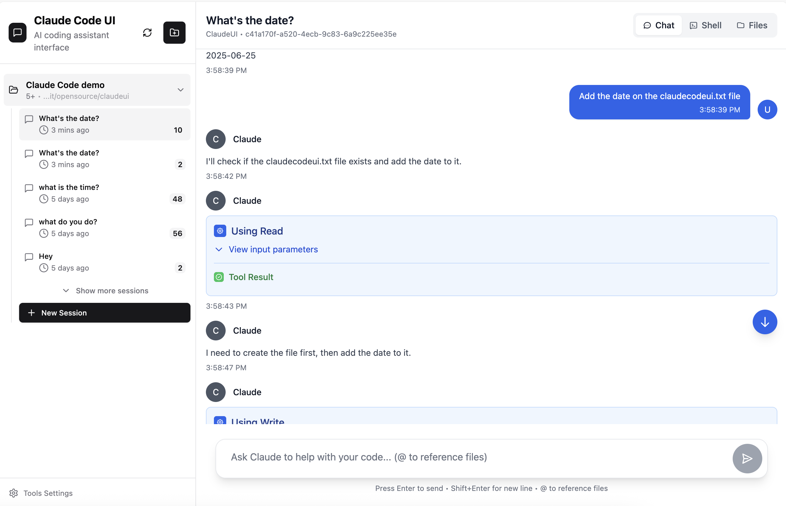
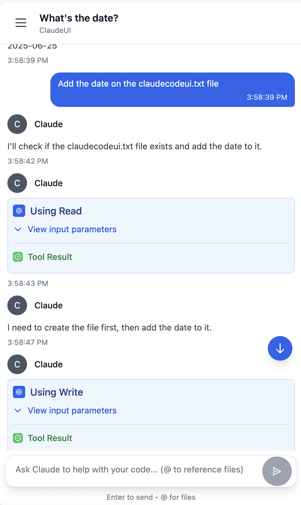
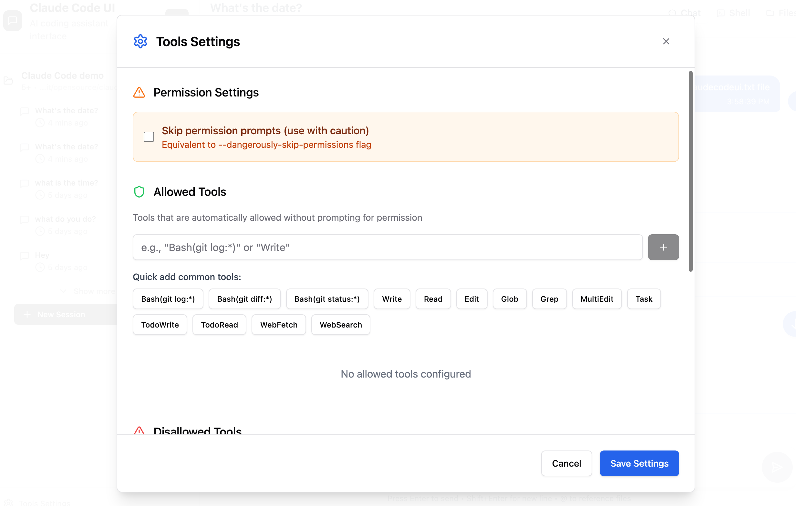

<div align="center">
  
  <h1>Claude Code UI - macOS Native App Edition</h1>
</div>

A desktop and mobile UI for [Claude Code](https://docs.anthropic.com/en/docs/claude-code), enhanced with **macOS native app integration**. This fork adds Dock support, menu bar status, and seamless mobile access.

## 🎯 macOS Native Features

- **🖥️ Dock App** - Launch directly from your Dock with ClaudeUI.app
- **📊 Menu Bar Status** - Real-time status monitoring with SwiftBar
- **📱 Mobile Ready** - Automatic IP detection for iPhone/iPad access
- **🔄 Process Management** - PM2 integration for reliability
- **⏰ Activity Logging** - Track all starts/stops with timestamps 

## Screenshots

<div align="center">
  
<table>
<tr>
<td align="center">
<h3>Desktop View</h3>

<br>
<em>Main interface showing project overview and chat</em>
</td>
<td align="center">
<h3>Mobile Experience</h3>

<br>
<em>Responsive mobile design with touch navigation</em>
</td>
</tr>
</table>


</div>

## Features

- **Responsive Design** - Works seamlessly across desktop, tablet, and mobile
- **Interactive Chat Interface** - Built-in chat interface for seamless communication with Claude Code
- **Integrated Shell Terminal** - Direct access to Claude Code CLI through built-in shell functionality
- **File Explorer** - Interactive file tree with syntax highlighting and live editing
- **Session Management** - Resume conversations, manage multiple sessions, and track history


## Quick Start

### Prerequisites

- macOS with Homebrew installed
- [Node.js](https://nodejs.org/) v24.3.0 or higher
- [Claude Code CLI](https://docs.anthropic.com/en/docs/claude-code) installed and configured
- PM2 (`npm install -g pm2`)

### Installation

1. **Clone the repository:**
```bash
git clone https://github.com/starworld/claudecodeui-macos.git
cd claudecodeui-macos
```

2. **Install dependencies:**
```bash
npm install
```

3. **Configure environment:**
```bash
cp .env.example .env
# Edit .env with your preferred settings
```

4. **Create macOS App (see IMPLEMENTATION_GUIDE.yaml for details):**
```bash
# Quick setup - check implementation guide for full instructions
cat IMPLEMENTATION_GUIDE.yaml
```

5. **Start the application:**
```bash
# Using the start script
./scripts/start-claude-ui.sh

# Or directly with PM2
pm2 start ecosystem.config.js
```

6. **Access the application:**
   - Local: `http://localhost:3009`
   - Mobile: Check console output for IP address

### macOS Native Setup

1. **Install SwiftBar for menu bar:**
```bash
brew install swiftbar
# When prompted, select: ~/Library/Application Support/SwiftBar/Plugins
```

2. **Create Dock App:**
   - Run commands from `IMPLEMENTATION_GUIDE.yaml` Phase 1
   - Drag `/Applications/ClaudeUI.app` to your Dock

3. **Menu Bar Features:**
   - 🟢 CI = Running
   - ⚪ CI = Stopped
   - Click for quick actions

## Security & Tools Configuration

**🔒 Important Notice**: All Claude Code tools are **disabled by default**. This prevents potentially harmful operations from running automatically.

### Enabling Tools

To use Claude Code's full functionality, you'll need to manually enable tools:

1. **Open Tools Settings** - Click the gear icon in the sidebar
3. **Enable Selectively** - Turn on only the tools you need
4. **Apply Settings** - Your preferences are saved locally

<div align="center">


*Tools Settings interface - enable only what you need*

</div>

**Recommended approach**: Start with basic tools enabled and add more as needed. You can always adjust these settings later.

## Usage Guide

### Core Features

#### Project Management
The UI automatically discovers Claude Code projects from `~/.claude/projects/` and provides:
- **Visual Project Browser** - All available projects with metadata and session counts
- **Project Actions** - Rename, delete, and organize projects
- **Smart Navigation** - Quick access to recent projects and sessions

#### Chat Interface
- **Use responsive chat or Claude Code CLI** - You can either use the adapted chat interface or use the shell button to connect to Claude Code CLI. 
- **Real-time Communication** - Stream responses from Claude with WebSocket connection
- **Session Management** - Resume previous conversations or start fresh sessions
- **Message History** - Complete conversation history with timestamps and metadata
- **Multi-format Support** - Text, code blocks, and file references

#### File Explorer & Editor
- **Interactive File Tree** - Browse project structure with expand/collapse navigation
- **Live File Editing** - Read, modify, and save files directly in the interface
- **Syntax Highlighting** - Support for multiple programming languages
- **File Operations** - Create, rename, delete files and directories

#### Session Management
- **Session Persistence** - All conversations automatically saved
- **Session Organization** - Group sessions by project and timestamp
- **Session Actions** - Rename, delete, and export conversation history
- **Cross-device Sync** - Access sessions from any device

### Mobile Experience
- **Responsive Design** - Optimized for all screen sizes
- **Touch-friendly Interface** - Swipe gestures and touch navigation
- **Mobile Navigation** - Bottom tab bar for easy thumb navigation
- **Adaptive Layout** - Collapsible sidebar and smart content prioritization

## Architecture

### System Overview

```
┌─────────────────┐    ┌─────────────────┐    ┌─────────────────┐
│   Frontend      │    │   Backend       │    │  Claude CLI     │
│   (React/Vite)  │◄──►│ (Express/WS)    │◄──►│  Integration    │
└─────────────────┘    └─────────────────┘    └─────────────────┘
```

### Backend (Node.js + Express)
- **Express Server** - RESTful API with static file serving
- **WebSocket Server** - Communication for chats and project refresh
- **Claude CLI Integration** - Process spawning and management
- **Session Management** - JSONL parsing and conversation persistence
- **File System API** - Exposing file browser for projects

### Frontend (React + Vite)
- **React 18** - Modern component architecture with hooks
- **CodeMirror** - Advanced code editor with syntax highlighting


### Contributing

We welcome contributions! Please follow these guidelines:

#### Getting Started
1. **Fork** the repository
2. **Clone** your fork: `git clone <your-fork-url>`
3. **Install** dependencies: `npm install`
4. **Create** a feature branch: `git checkout -b feature/amazing-feature`

#### Development Process
1. **Make your changes** following the existing code style
2. **Test thoroughly** - ensure all features work correctly
3. **Run quality checks**: `npm run lint && npm run format`
4. **Commit** with descriptive messages following [Conventional Commits](https://conventionalcommits.org/)
5. **Push** to your branch: `git push origin feature/amazing-feature`
6. **Submit** a Pull Request with:
   - Clear description of changes
   - Screenshots for UI changes
   - Test results if applicable

#### What to Contribute
- **Bug fixes** - Help us improve stability
- **New features** - Enhance functionality (discuss in issues first)
- **Documentation** - Improve guides and API docs
- **UI/UX improvements** - Better user experience
- **Performance optimizations** - Make it faster

## Troubleshooting

### Common Issues & Solutions

#### "No Claude projects found"
**Problem**: The UI shows no projects or empty project list
**Solutions**:
- Ensure [Claude CLI](https://docs.anthropic.com/en/docs/claude-code) is properly installed
- Run `claude` command in at least one project directory to initialize
- Verify `~/.claude/projects/` directory exists and has proper permissions
d

#### File Explorer Issues
**Problem**: Files not loading, permission errors, empty directories
**Solutions**:
- Check project directory permissions (`ls -la` in terminal)
- Verify the project path exists and is accessible
- Review server console logs for detailed error messages
- Ensure you're not trying to access system directories outside project scope


## License

GNU General Public License v3.0 - see [LICENSE](LICENSE) file for details.

This project is open source and free to use, modify, and distribute under the GPL v3 license.

## Acknowledgments

### Built With
- **[Claude Code](https://docs.anthropic.com/en/docs/claude-code)** - Anthropic's official CLI
- **[React](https://react.dev/)** - User interface library
- **[Vite](https://vitejs.dev/)** - Fast build tool and dev server
- **[Tailwind CSS](https://tailwindcss.com/)** - Utility-first CSS framework
- **[CodeMirror](https://codemirror.net/)** - Advanced code editor


## Support & Community

### Stay Updated
- **Star** this repository to show support
- **Watch** for updates and new releases
- **Follow** the project for announcements

---

<div align="center">
  <strong>Made with care for the Claude Code community</strong>
</div>